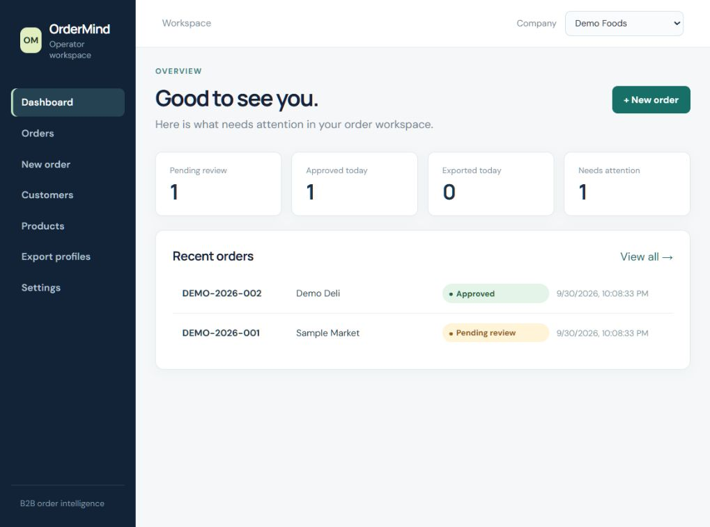
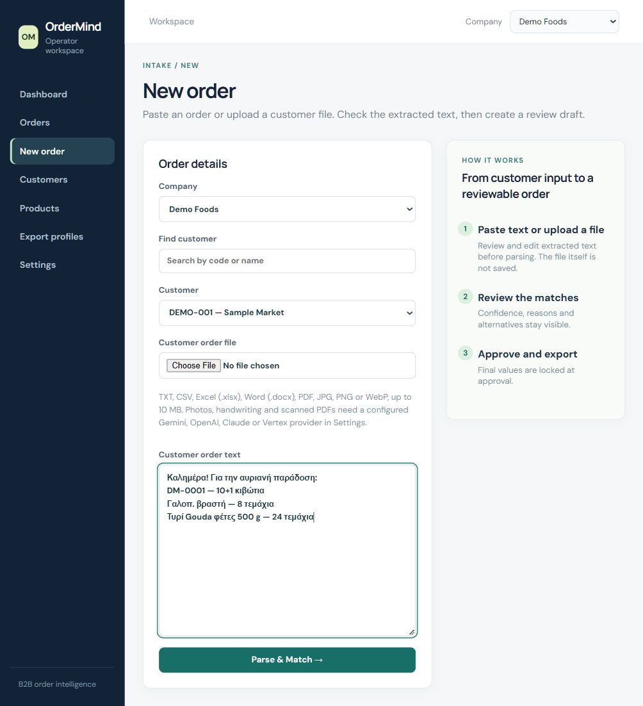
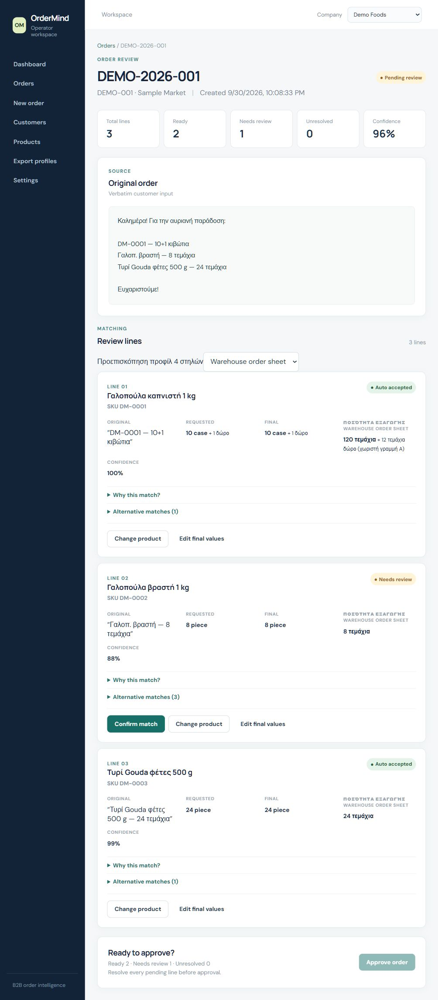
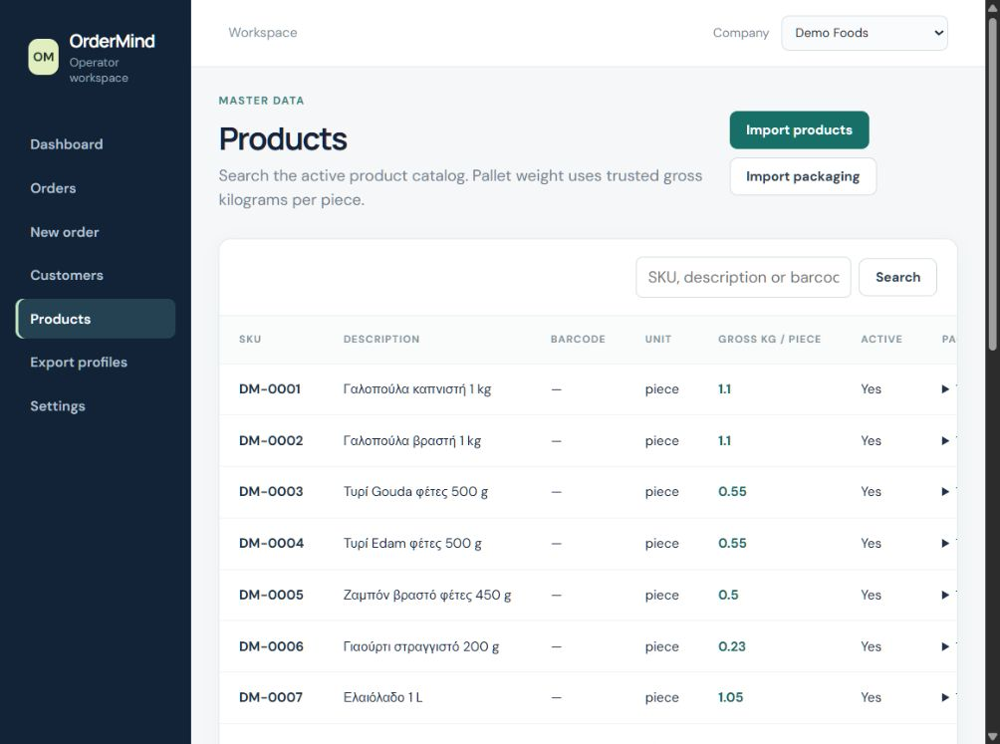
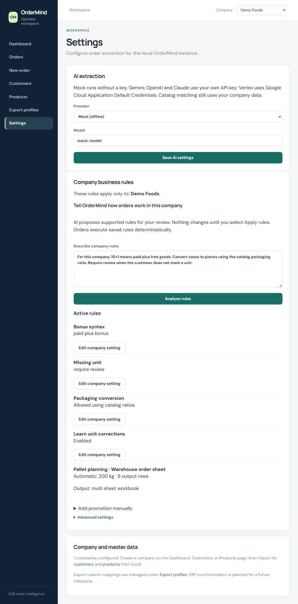
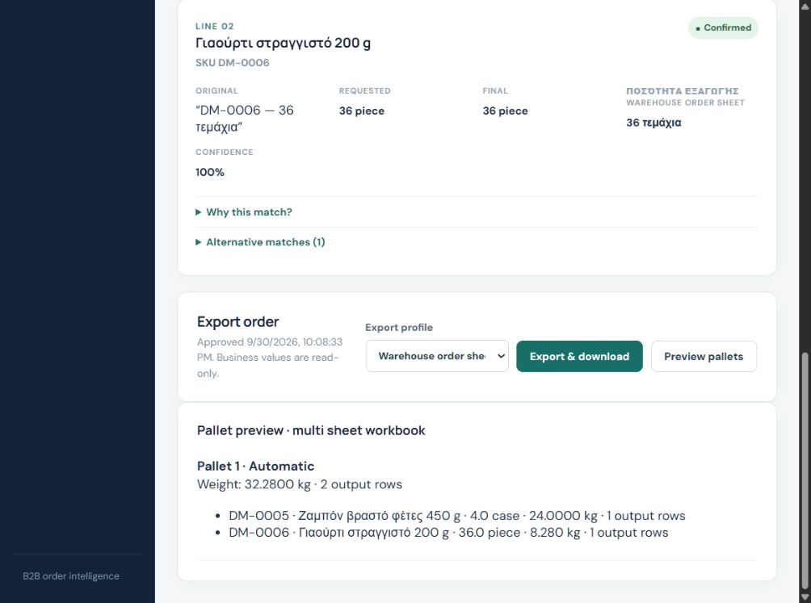

# Operator workspace walkthrough

OrderMind brings customer input, company catalogs, operator decisions, and approved exports into one local workspace.

These screenshots show the real application with **synthetic data** for Demo Foods. The demo uses the mock provider; it does not demonstrate remote AI or OCR accuracy. Business rules and packaging ratios are explicitly configured for this example. New companies start with neutral rules.

## 1. Track orders

The dashboard highlights pending reviews, approved orders, and lines needing attention. The company selector scopes the workspace to the selected company's data.

## 2. Bring in customer input

Select a customer, paste an order, or upload a supported document or image. File preview produces editable text for the operator to check before parsing. Photos and scanned PDFs require a configured remote provider.

## 3. Review catalog matches and final quantities

Compare the original customer wording with the suggested catalog product, confidence, requested unit, and final quantity. Confirm or correct uncertain lines before approval.

Here, the configured paid-plus-bonus convention interprets `10+1 κιβώτια` as ten paid cases and one free case. With twelve pieces per case and piece output enabled on the selected export profile, the preview shows **120 pieces plus 12 bonus pieces**, with the bonus on a separate row marked `Α`. Another line remains pending review.

## 4. Maintain company catalogs

Browse products and their trusted gross weight per piece. Products and packaging have separate Excel imports with column preview and mapping; packaging ratios connect cases to pieces.

## 5. Configure company conventions

Choose the extraction provider and model, then configure the selected company's business rules. The rules assistant can propose settings from a natural-language description; an operator must review and apply the proposal. Manual controls remain available.

This screen shows mock extraction and example company conventions. The text in the assistant is an **unsaved description**, not an applied AI proposal.

## 6. Preview pallets before export

After approval, select an export profile. Profiles with palletization enabled in the approved snapshot expose a preview of pallet assignments, physical gross weight, and output row counts. Runtime planning is deterministic.

The example below contains four cases of one product and 36 pieces of another, totaling **32.28 kg** on one pallet. Approval freezes the business values used by the export.

## Try it locally

Follow the [README setup and first-order instructions](../README.md#first-local-run-windows-powershell). Synthetic Excel samples are available in [`backend/fixtures`](../backend/fixtures/). These screenshots are illustrations of a configured workflow; the pictured demo catalog and orders are not installed automatically.
